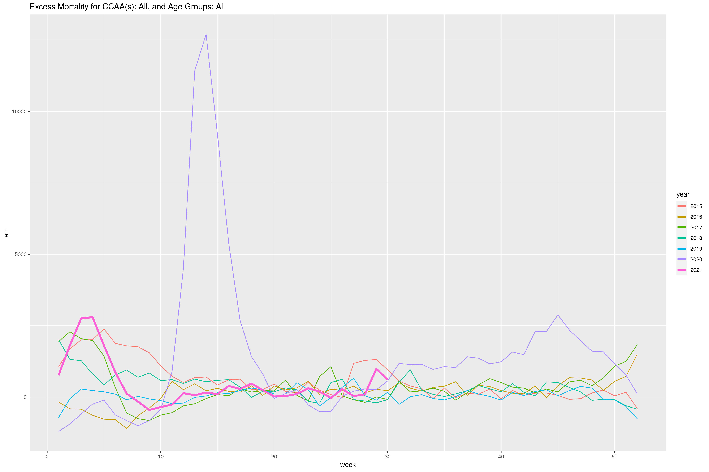

```{r setup, include=FALSE}
knitr::opts_chunk$set(
collapse = TRUE,
comment = "#>",
fig.path = "./figures/"
)
```

\newpage

# Summary

As a result of the COVID-19 pandemic and its large impact across Spain, the monitoring of demographic measures as a direct result of deaths related to such pandemic and future similarly deadly events has become increasingly important. It is intended with this project to develop a tool to easily monitor a selection of demographic measures. All related to collective deaths of individuals as a result of relevant worldwide events like the one mentioned previously, or perhaps other smaller scale events which could increase mortality in a likely fashion.

The tool consists of an [open-source](https://github.com/dreth/tfm_uc3m) [Shiny-based](https://shiny.rstudio.com/) dashboard (developed in R) where such measures are displayed in different visualizations across time. The dashboard is containerized using Docker, in order to make possible to run and use in in any operating system. The data is acquired from the [INE](https://ine.es/) and [Eurostat](https://ec.europa.eu/eurostat/) APIs. It is then treated by several Python scripts and stored in a GitHub [repository](https://github.com/dreth/tfm_uc3m_data) where it can be updated by anyone running the application.

# Introduction

The COVID-19 pandemic has led to a widespread and noticeable temporary increase in mortality, as well as to a reduction in life expectancy throughout Spain. This arises a need to monitor these demographic measures more closely and in real time. 

This project consists in developing an application which allows for active, real-time monitoring of mortality and life expectancy of the population of Spain, through an [open-source](https://github.com/dreth/tfm_uc3m) shiny web-based dashboard.

The application itself consists of the following functionality:

- Visualizing several mortality metrics:
    - Excess mortality
    - Cumulative mortality rate
    - Cumulative relative mortality rate
    - Mortality improvement factor

- Visualizing life expectancy and constructing life tables

- Visualizing a map of Spain with the previous metrics per autonomous community (CCAA)

All metrics are calculated weekly with data obtained from INE and Eurostat, starting from the year 2010.

\newpage

# Objectives

The main objectives of the project are the following:

- To provide an open-source, simple-to-use, web-based, OS-agnostic tool to compute and visualize common mortality-related metrics and life expectancy in time series plots, and static or interactive maps.

    + A big focus of the project was to make this application as simple-to-use as possible, while maintaining the management of system requirements extremely low. The purpose of such approach is to allow virtually anyone that desires to monitor any of the metrics to do so by running a simple shell command. We want any user or institution with access to a computer and the internet to be able to monitor these metrics, or any such metrics which could be possibly added in the future without much hassle. 

    + An important prerequisite was to make the proyect open-source. This allows anyone to freely use and improve the project by adding extra components like other useful mortality-related measures. This makes the project fully auditable and free to use, modify and extend. The project is licensed using the [GNU General Public License V3](https://www.gnu.org/licenses/gpl-3.0.en.html).

- To provide the user with the ability to meaningfully customize the plot parameters.

    + The application itself should have several controls that allow the user to customize visualizations. Some of them are: what years to visualize, what metrics to visualize, what range of weeks to visualize (between 1 and 52), which CCAAs or age groups to aggregate, whether to make the plots interactive (using *plotly*) or static (using *ggplot2*), and so on. Different options will be available for different plots.

- To p3rovide the user the ability to download the plots and the data (with or without filtering).

    + The application shall include a download button with several options for all plots displayed within the application. The user can select the size of the plot from a list of predefined sizes, or specify the image resolution and the format from a list of available ones. We intend to make it so that any plot generated within the app can be downloaded.

- Allow the user to update and upload the data to the corresponding GitHub [repository](https://github.com/dreth/tfm_uc3m_data) hosting the data, from within the application.

    + The data is constantly changing, and as soon as the data sources have new data available, the application will tell the user there is new data, and the user will be able to update the data with the click of a button. The updated data will be fetched, ran through the pipeline, and uploaded to the [data repository](https://github.com/dreth/tfm_uc3m_data) for the project on GitHub. This ensures that the data is always updated and anyone is able to do so for everyone else from anywhere in the world.

- Have data updated in real-time from the official Spanish sources (INE) and Eurostat (also provided by INE).

    + Every time the app runs, it'll check if there's available data and display the most recent week for which there is data available, this way we allow anyone running the application to see if there is new data whenever the app is ran so they can update it if they desire to do so.

\newpage

# Motivation

As we saw during the COVID-19 pandemic, the most widely publicized measures shown to the public in order to explain the status of the pandemic and the country as a whole were always related to incidence of the virus, death counts, recovery counts, amount of patients at ICU, hospitalized patients by COVID-19 vs total hospitalized patients, etc. However, **Death counts do not tell the whole story**, a death count merely tells us that an amount of people died, it does not tell us how much that amount of deaths affect the population. Also, **all these measures are static**, therefore, we cannot see the effect they cause on the population in the long term, which is where measures like the *cumulative relative mortality rate* or *life expectancy* come in, these show the impact of deaths and their long lasting effect relative to the population over time. 

As an example, 100 people dying over the course of a week within a municipality of 10,000 inhabitants represents 1% of the population; that same amount of deaths would represent less than 0.01% of the population within a municipality of 1 million inhabitants. Therefore, more robust measures to determine the impact of the deaths caused by a pandemic are needed to really gauge the effect of the pandemic as a whole.

The application allows monitoring some of these measures in real time. Whenever it is desired to fetch new data (if available), the data can be fetched with a click. The measures can be instantly computed with a click and visualized to observe the evolution of the population at any time, by age group, sex and by autonomous community (CCAA) of Spain. Showcasing particular usefulness within events that cause large amounts of deaths (like a pandemic, war, or heat wave) or that reduce the general populations life expectancy (as the application can also visualize the evolution of life expectancy over time).

## Inspiration

The [Mortality monitor reports](https://www.actuaries.org.uk/learn-and-develop/continuous-mortality-investigation/other-cmi-outputs/mortality-monitor) published on a weekly basis by the Institute and Faculty of Actuaries of the UK was the strongest influece. The application essentially offers the same metrics and more. The intention is to improve this already quite good and useful report, make it interactive and customizable, and localize it to Spain. Currently, neither the INE (National Statistics Institute of Spain) or any other Spanish institution offer these metrics along with the rest of the features the app offers (visualizing maps, life expectancy, etc) on a per-week basis.

The [COVID-19 vaccine surveillance report: Week 27](https://assets.publishing.service.gov.uk/government/uploads/system/uploads/attachment_data/file/1000512/Vaccine_surveillance_report_-_week_27.pdf), published by the PHE (Public Health England) also partly exemplifies a similar idea in its "direct impact on infection and mortality" section. 

## Advantages of an open source application over weekly reports in PDF format

There are several advantages an application could potentially have over static, weekly PDF reports like the one previously linked in the [Inspiration] section:

- The user has control over the visualizations, as there are controls to manipulate the parameters of the visualizations and interact with them.  

- The user can download the customized visualizations in their desired resolution or format.

- The user can choose what measures of those available to show.

- As the application is [open source](https://github.com/dreth/tfm_uc3m), developers could expand the application and add extra features and contribute directly to the project's development.

- The measures will be as up-to-date as the data source is. As these reports take time to construct and analyze, they will take longer to be released, so the user can simply open the application and update the database whenever they desire to do so.

## Why is monitoring mortality/life expectancy metrics important?

As it is with any demographic measure, knowing general metrics about population is important to many companies, institutions and individuals, to list a few:

- The Government and the Ministry of Health, the main decisionmakers in terms of public health related issues. These two institutions can use these metrics to construct policies or regulations to protect the general health of the population, prioritize or purchase particular medication or medical utensils if needed, etc.

- Insurance companies, those to which customers, companies, governments and other institutions transfer risk in order to protect themselves financially from health-related liabilities or death. Insurance companies directly use life tables to measure risk when providing life insurance to customers, and in order to remain profitable and offer a risk-assessed quality service to their customers these metrics modulate insurance premiums and aid in the process of decisionmaking when it comes to offering a policy to what the company could deem high or low risk customers.

- Ordinary people. Perhaps mere curiosity or desire to be informed, being able to know in a timely manner whether the population is at risk or healthy helps people make choices regarding how to take care of themselves or how to take care of their loved ones.

# Metrics computed by the application {#Metrics}

The application's visualizations are especially focused on 3 specific mortality metrics inspired by [the regular rolling report by UK's Institute and Faculty of Actuaries](https://www.actuaries.org.uk/learn-and-develop/continuous-mortality-investigation/other-cmi-outputs/mortality-monitor):

- [[Cumulative mortality rate]{color="black"}](#CMR)

- [[Cumulative relative mortality rate]{color="black"}](#CRMR)

- [[Mortality improvement factor]{color="black"}](#CMIF)

Given the host of other possible metrics to be included, which are also related to the ones previously mentioned, we decided to include the following two additional metrics as a way to extend the capabilities of the application: 

- [[Excess mortality]{color="black"}](#EM)

- [[Life expectancy]{color="black"}](#LE)

\newpage

## Excess mortality {#EM}

The term *excess mortality* ($EM$) refers to a measurement which corresponds to the difference between the average deaths which have ocurred during the $n$ years prior to the current $t$ time. Typically, the window of years to compute the average deaths is often $n = 5$. For the application, a window of $n = 5$ years is used to compute the measurement.

If excess mortality is very high and above zero, then there have been more deaths than the previous $n$ year average, if the number is smaller than zero, then there have been less deaths than the previous $n$ year average.

Excess mortality is used to assess how many more or less deaths than the previous years' average have ocurred. This way it's possible to determine if there is an increase in deaths that exceed what has been considered "normal". 

During the COVID-19 pandemic the measurement was particularly useful as mortality spiked beyond the expectations of pretty much any country where the pandemic became widespread. Spain is no exception, and during the time where the deaths were at their peak, the excess mortality of that period of time was a highly publicized measure to illustrate how many deaths above what usually occurs happened. As a result of the COVID-19 pandemic, future measures calculated after 2020 must exclude 2020 and 2021 from the calculation as the death counts are anomalous compared to previous and subsequent years prior the COVID-19 pandemic.

For the years between 2021 and 2027 inclusive, the application uses the same 5-year moving average used for 2020, meaning the average deaths corresponding to week $w$ for $2015 \leq y \leq 2019$. After 2027 or prior to 2021 the average death counts used are computed from the 5 year window prior to the year(s) selected. For example, the average deaths for $w = 1$, 2019 will correspond to the average deaths during $w = 1$ for the years $2014 \leq y \leq 2018$, and the average deaths for $w = 1$, 2022 will correspond to the same average deaths observed on $w = 1$ for the years $2015 \leq y \leq 2019$.

The $EM$ for week $w$ of year $y$ is computed as follows:

$$EM_{w, y} = \frac{D_{w, y}}{\overline{D_{w, y-5, y}}}$$

Where:

- $D_{w, y}$: death count for week $w$ of year $y$

- $\overline{D_{w, y-5, y-1}}$: average death count for week $w$ of years $y-5$, $y-4$, $\dots$, $y-1$.

Exact definition:

$$EM_{w, y} = \frac{D_{w, y}}{\frac{1}{n} \sum^{n}_{k=1} D_{w, y-k}}$$

Where:

- $D_{w, y}$: death count for week $w$ of year $y$

- $n$: years to look back to, default is $n = 5$

- $D_{w, y-k}$: death count for week $w$ of year $y-k$, where $k$ starts at $k=1$ and ends at $n$ with $k \in \mathbb{N}$.

We can see an example of the most generalized $EM$ plot the application can produce:



In Figure 1, we can clearly notice a pattern where 2020 severely exceeded the mortality expected value of the previous 5 years. Particularly during the 1st wave of COVID-19 (around march, april and may), and towards the end of the year (around october, november and december).

\newpage

## Cumulative mortality rate {#CMR}

The *cumulative mortality rate* ($CMR$) represents the ratio between the sum of all deaths during the first week of a year up to a user-defined week of the same year, and the population at that same user-defined week and year, where weeks must be $1 \leq w \leq 52$.

This ratio can be used standalone to gauge the amount of deaths in a time period divided by the population alive at that time period, but, it is most commonly used in this project as a component of the more informational *[[cumulative relative mortality rate]{color="black"}](#CRMR)* or *[[mortality improvement factor]{color="black"}](#CMIF)*. 

The ratio is computed, depending on user selection, for years stretching as far back as 2010 and as updated as the current year. It can only be computed for any specified range between 1 and week $w$. 

The $CMR$ for year $y$ and up to week $s$ is computed as follows:

$$CMR_{w, y} = \frac{\sum^{s}_{w=1} D_{w, y}}{P_{w, y}}$$

Where:

- $D_{w, y}$: death count for week $w$ of year $y$.

- $P_{w, y}$: population at week $w$ of year $y$

- $s$: upper bound of week for which the death count is computed, with $1 \leq s \leq 52$ and $s \in \mathbb{N}$.

Here we see an example of the $CMR$ time series computed by the application:


Figure 2, in contrast to the Figure 1 shows the long term cumulative effect of increased mortality. Here 2020 rises above every other year in terms of $CMR$. We can also see 2021 showing a meaningful recovery from 2020 but following the path of 2015, which prior to the arrival of the pandemic was considered a particularly bad year in terms of mortality.

## Cumulative relative mortality rate {#CRMR}

The *cumulative relative mortality rate* ($CRMR$) corresponds to the ratio of the difference between the cumulative mortality rate ($CMR$) at a specified week and the average $CMR$ between years $n-k$ and $n-1$ inclusive, and the average $CMR$ in that same range of years for their last week (the 52nd week).

The $CRMR$ allows us to show the medium to long-term effect of catastrophic or mortality-rising events on the population based on the $CMR$. 

The effect of long-lasting events like the COVID-19 pandemic clearly show how mortality can part away from the mean significantly and how the cumulative effect of such mortality can rise to unprecedented levels for relatively long periods of time.

This particular metric can be affected significantly by events which we might perceive as not-so-dramatic when they occur (perhaps like a severe heat wave), but it lets us historically see how much worse or better (in terms of mortality) a given time period can be.


In our particular case, the metric has been computed using the average $CMR$ for years between 2010 and 2019. 2020 is explicitly excluded, as the effect of the COVID-19 pandemic would skew our perspective on 2021 mortality and further years. 

The $CMR$ for the last week of those years is averaged as it includes the entire year, given that the CMR is computed for a range of weeks starting at week 1 and ending at week $s$, for this metric we compute the denominator for week $s=52$ and the numerator for a specified week range.

The $CRMR$ for week $w$ of year $y$ has been computed as follows:

$$CRMR_{w, y} = \frac{CMR_{w, y} - \frac{1}{10} \sum^{2019}_{y=2010} CMR_{w, y}}{\frac{1}{10} \sum^{2019}_{y=2010} CMR_{w=52, y}}$$

Where:

- $CMR_{w, y}$ is the *cumulative mortality rate* at week $w$ of year $y$

\newpage

Here is an example plot of the $CRMR$ we can generate for all age groups, sexes and CCAA aggregated:


As we can notice in Figure 3, 2020 severely exceeded the previous years' $CRMR$ throughout the year right after the pandemic started, and the trend was sustained throughout the whole year. The dramatic increase towards the first wave of the pandemic completely skews the y-axis scale of the plot. We can also notice how the start of 2021 was also out of the ordinary, eventually returning to levels seen around 2015 (a year previously considered particularly bad for mortality in Spain), as the pandemic has continued to extend, but with a significantly smaller $CRMR$ than that of 2020 given the widespread vaccinations and more experienced treatment of the virus.

\newpage

## Cumulative mortality improvement factor {#CMIF}

The *cumulative mortality improvement factor* ($CMIF$) at a specific week $w$ of a year $y$ is an actuarial measure defined as the ratio of the difference between the $CMR$ at week $w$ for the previous year $y-1$ and the $CMR$ at week $w$ for the current year $y$, and the $CMR$ at week 52 for the previous year $y-1$.

The $CMIF$ is used to assess how much mortality is improving within specific age ranges, or the population as a whole. By "improvement factor" we mean that it could either get "better" or get "worse", the "better" the $CMIF$ gets, the lower the mortality is, the "worse" it gets, the opposite, meaning mortality will be higher.

This measure is an excellent one when it comes to determining a population's longevity. If the improvement factor is high, then the older the population can become, in some ways, very similarly to life expectancy.

The metric is particularly useful for older age groups, which during the COVID-19 pandemic saw a significant increase in mortality as a result of it being a virus especially dangerous to older age groups and it also being very easily spread throughout populations. In Spain in particular, retirement homes are very commonly used to house retired elderly people. The virus was unfortunately spread among some retirement homes causing very high mortality. These events directly affect the improvement factor negatively. Improvement factors are especially useful in insurance, where they're often used to compute projections for life insurance policies.

For the application in particular, the $CMIF$ can be computed for years above 2011, as the data only stretches as far back as 2010 and the measure looks back 1 year. 

The $CMIF$ for week $w$ of year $y$ is computed as follows:

$$CMIF_{w, y} = \frac{CMR_{w, y-1} - CMR_{w, y}}{CMR_{w=52, y-1}}$$

Where:

- $CMR_{w, y}$ is the *cumulative mortality rate* at week $w$ of year $y$

\newpage

As a way to exemplify, we can also show a plot for the $CMIF$, as plotted through the application:


As for the $CMIF$ visualized in Figure 4, it is clear how significant the decline of the $CMIF$ is for 2020, and how noticeable of an improvement the widespread vaccination has been during 2021.

Comparatively we can say that rises in $CRMR$ correspond with declines in $CMIF$. 

\newpage

## Life expectancy {#LE}

*Life expectancy* ($LE$) is a measure that estimates the time an organism is expected to live. It is computed for a specific age group $A$ using a *life table*, which is a table commonly used in actuarial science, demography and life insurance policy risk modelling that shows the probability that a person of a certain age or age group will die before reaching their next birthday or entering the next age group. The last column of it commonly corresponds with the *life expectancy* for that age or age group based on that probability of death.

$LE$ at birth would correspond to the $LE$ of the youngest age group in the table, assumming we don't have the *infant mortality rate* ($IMR$).

The purpose of this measure is to track how long we should expect our population to live. As an upper limit on how old we should expect the population to become. It is widely used in insurance to calculate insurance premiums on life insurace policies, and to determine if it's even profitable to offer such policies to an individual. A very old individual would be surcharged for a life insurance policy or be rejected altogether when attempting to acquire the policy given their high risk of death and very low life expectancy.

It also gives us a perspective on perhaps how developed a country is, given that most developed countries a have relatively high life expectancy for their population.

For the purposes of this application, it is useful to track the effect mortality has on how long we should expect the Spanish population to live. In particular, mortality as a result of the COVID-19 pandemic has affected life expectancy significantly, however, perhaps not in a permanent way, as mortality eventually goes back to the mean, and with it, so does life expectancy.

As we need to compute $LE$ for specific weeks/years and display them as a time series, we must then calculate a *life table* per week.

The process is largely inspired from the following methodology explained on the [MEASURE evaluation website](https://www.measureevaluation.org/resources/training/online-courses-and-resources/non-certificate-courses-and-mini-tutorials/multiple-decrement-life-tables/lesson-3.html). However, it was adapted to fit weekly measures by taking data one year prior to the specified week. Calculations after the step 2 described below are nearly identical to those displayed on the previously linked article.

To compute $LE$ we must first compute a life table as follows, note that each step also corresponds to a column of the life table in the same order:

**1.** Compute the age-specific death rate ${}_{n}m_{x}$:

\begin{equation}
{}_{n}m_{x} = \frac{\sum \text{ } {}_{x,x+n}D_{w,y}}{{}_{x,x+n}P_{w,y}}
\end{equation}

Where:

|       - $\sum \text{ } {}_{x,x+n}D_{w,y}$ corresponds to the sum of deaths between week $w$ of the year $y$ and week $w$ of the year $y-1$ for individuals aged between $x$ and $x+n$.

|       - ${}_{x,x+n}P_{w,y}$ corresponds to the population at week $w$ of the year $y$  for individuals aged between $x$ and $x+n$.

**2.** Compute the proportion of individuals alive at the start of an age interval which are no longer alive at the end of that age interval (they die at some point during the interval), ${}_{n}q_{x}$:

|       a. For non open-ended age groups:

\begin{equation}
\tag{2.1}
{}_{n}q_{x} = 1 - \frac{1}{e^{n * {}_{n}m_{x}}}
\end{equation}

|       b. For open-ended age groups (ex. 90+ year olds):

\begin{equation}
\tag{2.2}
{}_{n}q_{x} = 1
\end{equation}

Where:

- $n$ is the length of the age interval. INE and Eurostat data is grouped in age interval lengths of $n = 5$.

- $e$ is the exponential function.


**3.** Use the previously calculated measure ${}_{n}q_{x}$ to compute $l_x$:

|       a. For the first value we set $l_0 = 100,000$

|       b. For the subsequent values, we calculate the next values using the previous one as a sequence:

\begin{equation}
\tag{3}
l_{x + n} = l_x * (1 - {}_{n}q_{x})
\end{equation}

Where:

|       - $x$ corresponds to the numbering of the age group, (ex. for *less than 5 year olds* which is our first age group, we have $l_0$, then $l_1$, and so on)

|       - $x+n$ corresponds to the next age group after $x$

**4.** Compute the number of deaths ocurred within each age interval ${}_{n}d_{x}$:

\begin{equation}
\tag{4}
{}_{n}d_{x} = l_x * {}_{n}q_{x}
\end{equation}

Where:

|       - The measure is calculated for individuals aged between $x$ and $x+n$

**5.** Calculate the person-years of life of all individuals in each age interval $x$ to $x+n$, ${}_{n}L_{x}$:

\begin{equation}
\tag{5}
{}_{n}L_{x} = \frac{{}_{n}d_{x}}{{}_{n}m_{x}}
\end{equation}

**6.** We calculate the cumulative person-years of life after age $x$, $T_x$. Therefore, for the first age group in the table, the value of $T_x$ will correspond to the sum of all ${}_{n}L_{x}$, the entire 5th column. For the second age group, it'll be the sum of all ${}_{n}L_{x}$ with the exception of the ${}_{n}L_{x}$ value of the first age group, and so on.

So:

|       a. For age groups different to the last one:

\begin{equation}
\tag{6.1}
T_x = \sum^{19}_{k=g} {}_{n}L_{x}
\end{equation}

|       b. For the last age group:

\begin{equation}
\tag{6.2}
T_x = {}_{n}L_{x}
\end{equation}

Where:

|       - $g$ is the number of the age group for which we want to compute the measure, so for group 1, $g=1$, and so on.

|       - The sum goes up to 19, as there are 19 age groups in our computation.

**7.** We compute the *life expectancy* ($LE$) of each age group as follows:

\begin{equation}
\tag{7}
e_{x} = \frac{T_x}{l_x}
\end{equation}

\newpage

Here we can see an example of the $LE$ time series computed by the app using the previously described methodology:


We can see in Figure 5 how notably life expectancy dropped during the pandemic, from being at its highest point in early 2020 to the lowest point for the past 5 years. 2021 shows a recovery and return to levels between 2015 and the period between the end of the 1st and start of the 2nd wave of COVID-19 during 2020. During the start of 2021 we also saw the previous 5-year low recorded by late 2020 beat by an even lower low around week 10.

\newpage

# Technologies used

The application utilizes several tools/services to perform the entire process of data querying, pre-processing, hosting and plotting.

- [**Python**](https://www.python.org/) is an interpreted general-purpose object-oriented programming language. It's used within this project for the entirety of the data querying, pre-processing and updating. 

- [**R**](https://www.r-project.org/) is a programming language and statistical computing environment. It's used within the project for the front end and back end of the dashboard, along with computations of all the metrics, visualizations and generation of maps within the application.

- [**Docker**](https://www.docker.com/) is a set of platform as a service products that use OS-level virtualization to package software in *containers*. It's used within the project to containerize the application into a simple package, which allows users to run the application with minimal setup and by installing virtually no requirements (other than Docker itself). The container is also hosted in [Docker Hub](https://hub.docker.com/r/dreth/tfm_uc3m).

- [**GitHub**](https://github.com) is a hosting provider for software development projects and version control using Git. We use it to host the application's [code](https://github.com/dreth/tfm_uc3m), the [Docker container](https://github.com/dreth/tfm_uc3m/pkgs/container/tfm_uc3m) and the [data](https://github/tfm_uc3m_data) used by the application.

# Data pipelines, hosting and application layout

There are 3 key components to this application:

- **Data querying, pre-processing, hosting and updating**
    + *Querying and pre-processing*: Data is obtained from the Eurostat and INE APIs and pre-processes using python. There's a pipeline for the deaths dataset (obtained from Eurostat) and a pipeline for the population dataset (obtained from INE). 
    + *Hosting and updating*: After querying and pre-processing, the data is hosted in a data-only [GitHub repository](https://github.com/dreth/tfm_uc3m_data), where it can be updated by any user of the application (as long as they're using the application within the Docker container).

- **Web application**: Both the front end and back end of the application are generated and managed using an R-based web framework called [Shiny](https://shiny.rstudio.com/).

- **Docker container**: The application is then packaged and containerized in order to make it platform-agnostic using [Docker](https://docker.com). To view the Dockerfile that generates the container, see [Appendix C](#AppendixC).

## Data querying and updating

The data querying process goes over two APIs, the Eurostat API and the INE API.

### Eurostat API querying

In order to query the Eurostat API, we need to execute several queries using the [```query_eurostat```](https://github.com/dreth/tfm_uc3m/blob/report_ref/api/functions.py#L23) function defined in the [functions.py](https://github.com/dreth/tfm_uc3m/blob/main/api/functions.py) script.

The queries are executed through the [query.py](https://github.com/dreth/tfm_uc3m/blob/main/api/query.py#L26) script upon user request.

In order to query the Eurostat API: 

1. We have to use the [Eurostat Query Builder](https://ec.europa.eu/eurostat/web/json-and-unicode-web-services/getting-started/query-builder). 

2. Pass in the database ID, in our case it's **demo_r_mwk2_05**, we select the parameters and then query the API. The parameters can be concatenated. 

The previously mentioned  [```query_eurostat```](https://github.com/dreth/tfm_uc3m/blob/report_ref/api/functions.py#L23) function does this, thereby simplifying the process of querying by just passing the parameters to the function as desired.

#### Death dataset update pipeline

As the Eurostat API returns a JSON, we must convert this response object into a workable pandas dataframe and eventually a CSV file, for easier storage and updating. 

The pipeline followed from when the data is obtained until it's updated the data hosted in the repository is the following, with the exception of the [data manipulation pipeline](#DeathDatasetPipeline), an intermediate step:

1. Open the [update_database.log](https://github.com/dreth/tfm_uc3m/blob/main/data/logs/update_database.log) log file, in which diagnostic messages related to the query are printed temporarily until the query is over.

2. Create an empty list where obtained raw datasets from the API will be added to.

3. Run a nested loop where we iterate over each age group (19 age groups) and sex (3 sexes, male, females and total) and the Eurostat API is queried for each combination of sex and age group. The queried data is queried as far back as the data is provisional (Week 1, 2020 at the time of writing).

4. Each obtained dataset is passed through the [```generate_death_df```](https://github.com/dreth/tfm_uc3m/blob/report_ref/api/functions.py#L84) function defined in the [functions.py](https://github.com/dreth/tfm_uc3m/blob/main/api/functions.py) script, which runs the steps described in the [pipeline for the death dataset](#DeathDatasetPipeline) section. Thereby generating a partial dataset for the current *age+sex* looping combination.

5. The previously generated partial dataset is added to the [```death_datasets```](https://github.com/dreth/tfm_uc3m/blob/main/api/query.py#L31) list created previously.

6. The datasets within the [```death_datasets```](https://github.com/dreth/tfm_uc3m/blob/main/api/query.py#L48) list are all concatenated using the [```pandas.concat```](https://pandas.pydata.org/pandas-docs/stable/reference/api/pandas.concat.html) function.

7. The updated dataset is passed as a parameter of the [```perform_update_datasets```](https://github.com/dreth/tfm_uc3m/blob/main/api/query.py#L51) function defined in the [functions.py](https://github.com/dreth/tfm_uc3m/blob/report_ref/api/functions.py#L447) script, which in turn checks the currently available dataset within the repository file tree, imports it, updates all the provisional data and appends the newly obtained data if available.

8. The acquired/updated dataset is exported as a CSV file.

### INE API querying

To query the INE API, a single query is executed using the [```query_INE_pop```](https://github.com/dreth/tfm_uc3m/blob/report_ref/api/functions.py#L146) function defined in the [functions.py](https://github.com/dreth/tfm_uc3m/blob/main/api/functions.py) script. 

The function executes a single query with data starting at the date defined by the *start* parameter of the function, whose default value is *20100101*, corresponding to the 1st of January, 2010. This single query returns a JSON response with all the data.

In order to query from INE we have to use their [data request](https://www.ine.es/dyngs/DataLab/en/manual.html?cid=1259945947373) (in Spanish) methods. In particular, the ones described in the "*Obtención de datos Sistema Tempus3*" section. In our case, we must create a URL like: ["https://servicios.ine.es/wstempus/js/ES/DATOS_TABLA/{df_id}?date={start}:{end}"]{color="green"}, where *df_id* is the ID of the database (**9681** for us), and *start* being where the time series will start and *end* where it will end. If *end* is left empty, then it'll fetch the most recent data.

#### Population dataset update pipeline

The INE API returns a JSON file with somewhat unique formatting, therefore, in order to generate a clean dataset and update the database with the cleaned up dataset, we need to go through a few steps. The intermediate step detailing the cleaning and pre-processing pipeline is detailed in the [data pre-processing pipeline](#PopDatasetPipeline) section for the population dataset.

1. Gather the latest week updated in the death dataset and assign it to the [```most_recent_week```](https://github.com/dreth/tfm_uc3m/blob/main/api/query.py#L49) object.

2. Open the [update_database.log](https://github.com/dreth/tfm_uc3m/blob/main/data/logs/update_database.log) log file, and log the start of the querying for the dataset.

3. Query the INE database using [```query_INE_pop```](https://github.com/dreth/tfm_uc3m/blob/main/api/query.py#L60).    

4. Run the data pre-processing pipeline using the function [```generate_pop_df```](https://github.com/dreth/tfm_uc3m/blob/main/api/query.py#L61) as defined in the [functions.py](https://github.com/dreth/tfm_uc3m/blob/report_ref/api/functions.py#L190) script. The steps for this pipeline are detailed its [corresponding section](#PopDatasetPipeline).

5. The updated dataset is passed as a parameter of the [```perform_update_datasets```](https://github.com/dreth/tfm_uc3m/blob/main/api/query.py#L63) function, which in turn checks the currently available dataset within the repository file tree, imports it, updates all the provisional data and appends the newly obtained data if available.

6. The acquired/updated dataset is exported as a CSV file.

## Data pre-processing pipeline {#PreProcessingPipeline}

After the data is acquired, then a pipeline to convert the raw JSON response from the APIs must be ran in order to construct actionable dataframes to store and use for the app. In these two sections there will be a description of all the steps in the pipeline for each of the two datasets. 

### Pipeline for the deaths dataset {#DeathDatasetPipeline}

The biggest challenge that the *deaths* dataset imposed was dealing with the indexing for the JSON response, as it had additional, and admittedly useless or empty data entries within the JSON. Also, the data obtained included a 53rd week for those years that don't fit the same exact number of weeks, this must be dealt with as well.

The function that performs all these tasks is the [```generate_death_df```](https://github.com/dreth/tfm_uc3m/blob/report_ref/api/functions.py#L84) function defined in the [functions.py](https://github.com/dreth/tfm_uc3m/blob/main/api/functions.py) script.

The pipeline steps are the following:

1. We define a [```fields```](https://github.com/dreth/tfm_uc3m/blob/report_ref/api/functions.py#L88) dictionary to obtain  all the relevant elements we want from the response JSON object. Each one of them corresponds to either the ```keys``` or ```values``` of the object, as JSONs are interpreted as *dictionaries* in python, which makes them easier to work with.

    + Here we exclude weeks marked as *W99* by Eurostat, which are basically empty values.

2. The amount of values in the raw data is obtained from the length of the ```values``` key in the ```fields``` dictionary. The amount of "region codes" is obtained from the length of the ```region_codes``` key in the ```fields``` dictionary, which are the CCAAs (autonomous communities of Spain). These two values are used to compute the amount of *weeks* obtained from the raw data, the result of this ratio is allocated in the ```weeks_queried``` object.

3. The ```timeframes``` key of the ```fields``` object that keeps track of the week label for each data point is cut up to the present date, as the current week always includes empty data. This cutoff is a way to keep the dataset with the same amount of data points and make it a multiple of the amount of CCAAs queried.

4. A [``df``](https://github.com/dreth/tfm_uc3m/blob/report_ref/api/functions.py#L107) dictionary is defined with its keys being the names of the columns of the final dataset to be outputted and its values being the values which the dataframe will contain with the exception of the *year_week* key which will later on be split into *week* and *year* columns.

    + The *year_week* column contains the values for the weeks times the amount of CCAAs queried, in our case, there will be 19 CCAAs queried, given that Spain has 19 CCAAs at the time of writing. 

5. The ``df`` dictionary is then converted into a pandas DataFrame and the *year* and *week* columns are generated from splitting the *year_week* column.

6. Data points marked as 53rd week are marked with a '0' to be removed and are then subsequently removed.

7. The *year_week* column is dropped and the resulting, cleaned up DataFrame is returned.

### Pipeline for the population dataset {#PopDatasetPipeline}

The population dataset response JSON came with challenges:

- The raw data had the full names of the CCAAs, so in order to keep the Eurostat standard, as it is shorter and would occupy less space in the repo, they were replaced.

- The sex also needed to be replaced, as it was in Spanish and it didn't go in line with the deaths dataset.

- The data is gathered on a bi-yearly basis, therefore, a linear interpolation between the two data points that INE records (in January and June) had to be applied to have weekly data. The linear interpolation had to also look ahead about 6 months, given that the data recorded by INE in either June or January takes about a month to be published. The deaths data is often much more up to date, as it is already recorded on a weekly basis, which sometimes causes the deaths data to go ahead of the population data. 

- The sheer size of the obtained JSON and its somewhat odd formatting compared to the previous one obtained from Eurostat requires a large inefficient loop to process. This looping was done using *numpy* arrays, which are often much faster than *pandas* DataFrames, this introduced a few new challenges in order to keep the updating script much more efficient.

- The data came for individual ages, therefore, to match and be able to perform the computation of the metrics [previously mentioned](#Metrics), grouping the people within the same specific age groups present in the previous dataset is needed.

All the steps are performed within the [```generate_pop_df```](https://github.com/dreth/tfm_uc3m/blob/report_ref/api/functions.py#L190) function defined in the [functions.py](https://github.com/dreth/tfm_uc3m/blob/main/api/functions.py) script. The pipeline steps are the following:

1. Define several dictionaries with reference data and replacements to align the formatting with the deaths dataset. The dictionaries defined are:
    
    + [```df```](https://github.com/dreth/tfm_uc3m/blob/report_ref/api/functions.py#L197-L203), which is going to eventually become the final population dataset. It contains as keys the names of the columns of the final population dataset and as values empty lists.

    + [```date_ref```](https://github.com/dreth/tfm_uc3m/blob/report_ref/api/functions.py#L206-L209) is a dictionary that includes the week as obtained from the API, which originally labels the January data point as 26 and the June data point as 27. These are matched in the object with roughly equivalent dates, Jan. 1st for 26 and Jul. 1st for 27. The conversion performed by this object remains only if the parameter **date** is **True**.

    + [```ccaa_eurostat_replace_dict```](https://github.com/dreth/tfm_uc3m/blob/report_ref/api/functions.py#L212-L232) is a dictionary that will serve as a reference for replacing the CCAA full names with the shorter Eurostat standard, which consists of the country's ISO 3166-1 alpha-2 code (*ES* for Spain) and a number per NUTS 2 statistical region (ex. *ES11* = *Galicia*).

    + [```sex_dict```](https://github.com/dreth/tfm_uc3m/blob/report_ref/api/functions.py#L235-L239) defines how the Spanish names for the sexes are determined, so longer, full names corresponding to each sex are replaced by the Eurostat standard, M (males), F (females) and T (total).

    + [```week_dict```](https://github.com/dreth/tfm_uc3m/blob/report_ref/api/functions.py#L242-L245) is a dictionary with the month (1 and 7) as keys and the corresponding week of the year (1 and 26) for which the data will be matched. This object is similar to ```date_ref```, however, the conversion made by ```date_ref``` is dependent on the parameter **date** of the function, which is not the case with ```week_dict```.

2. A [loop](https://github.com/dreth/tfm_uc3m/blob/report_ref/api/functions.py#L247-L279) goes through the raw data points and performs several actions inside of it:

    + Data points for the country's total are omitted given that we intend to perform these aggregations from within the Shiny App. These would also occupy unnecessary space in the repository.

    + The metadata elements from each entry's header which contain sex, age and CCAA are [split](https://github.com/dreth/tfm_uc3m/blob/report_ref/api/functions.py#L251) and passed onto the previously defined dictionaries. This replaces each entry's basic identifying information with the Eurostat standard.

    + The rest of the data is acquired, appended to lists and a date column is generated.

3. The ```df``` dictionary is [converted](https://github.com/dreth/tfm_uc3m/blob/report_ref/api/functions.py#L282) to a pandas DataFrame for easier manipulation. Then an empty *age_group* column is created, which later on will replace the *age* column, as to classify individuals by age group using the Eurostat format from the deaths dataset.

4. After assigning all individuals of all ages an age group, the *age* column is [dropped](https://github.com/dreth/tfm_uc3m/blob/report_ref/api/functions.py#L297), and the *age_group* column is [renamed](https://github.com/dreth/tfm_uc3m/blob/report_ref/api/functions.py#L298) to *age*, to match the column names of the deaths dataset. 

5. The dataset is grouped by all identifying columns (CCAA, sex, date and age) and applied the [```sum()```](https://github.com/dreth/tfm_uc3m/blob/report_ref/api/functions.py#L301) method on the grouping. The purpose of this is to sum individuals of specific ages as to have the sum of each age group instead of multiple instances of each age group per set of the identifying columns.

6. The *year* and *week* columns are [obtained](https://github.com/dreth/tfm_uc3m/blob/report_ref/api/functions.py#L304-L307) from the *date* column. And subsequently, a *marker* column is created as a way to identify entries at a later step. The *marker* column is created by [concatenating](https://github.com/dreth/tfm_uc3m/blob/report_ref/api/functions.py#L310) the *CCAA*, *sex* and *age* columns, which are the most important columns to identify entries.

7. The unique markers are [obtained](https://github.com/dreth/tfm_uc3m/blob/report_ref/api/functions.py#L313) from the *marker* column. These are then [used](https://github.com/dreth/tfm_uc3m/blob/report_ref/api/functions.py#L315-L321) to obtain the amount of unique years in the dataset, the purpose of this is to determine whether we need to interpolate one year ahead or not. This means that the last data point obtained from the INE API was a week 26 data point, which would require us to look ahead until week 26 of the following year, if the data point was a week 1 data point, we would only need to look ahead within the current year.

8. The [```idx```](https://github.com/dreth/tfm_uc3m/blob/report_ref/api/functions.py#L324-L327) dictionary is defined to keep track of the indexes of the *pop* and *week* columns, which are referenced repeatedly in the following [loop](https://github.com/dreth/tfm_uc3m/blob/report_ref/api/functions.py#L335). After defining ```idx```, then an empty array [```df_array```](https://github.com/dreth/tfm_uc3m/blob/report_ref/api/functions.py#L332) of the expected size of the resulting dataframe is defined. The array ```df_array``` is an array which will eventually contain the contents of the resulting dataframe, it's size is always slightly overestimated, but this won't matter, as empty rows will be dropped.

9. A long [loop](https://github.com/dreth/tfm_uc3m/blob/report_ref/api/functions.py#L335-L419) is initiated iterating between 0 and the length of the ```umarkers``` object, meaning the total amount of possible *CCAA*, *age* and *sex* combinations. The loop performs the following actions:

    + The loop goes [through every unique marker](https://github.com/dreth/tfm_uc3m/blob/report_ref/api/functions.py#L337), obtains an array for the elements of the DataFrame matching that marker in their *marker* column.

    + An empty row is [added](https://github.com/dreth/tfm_uc3m/blob/report_ref/api/functions.py#L338-L339) to the previous array.

    + The last row is essentially a [clone](https://github.com/dreth/tfm_uc3m/blob/report_ref/api/functions.py#L342) of the previous one, but with the date [modified](https://github.com/dreth/tfm_uc3m/blob/report_ref/api/functions.py#L346-L352). This is done to later on be able to interpolate and add population up to a year after the previously obtained data point. If the data point is at week 26, a full year is added, otherwise, the next one remains in the same year but with the month changed to match week 26.

    + The last element's population is [estimated](https://github.com/dreth/tfm_uc3m/blob/report_ref/api/functions.py#L355) using the ratio of the previous two as a way to keep the population consistent with the previously observed trend.

10. A second, nested [loop](https://github.com/dreth/tfm_uc3m/blob/report_ref/api/functions.py#L365-L388) is initiated, this loop goes through the entries of the array defined previously and performs the interpolation betweeen each pair of points. The steps the loop takes to perform the interpolation are the following:

    + A 2-row array is obtained with the 2 points between which to interpolate. Then the starting week is obtained from these two and a new array [```new_p```](https://github.com/dreth/tfm_uc3m/blob/report_ref/api/functions.py#L373) is created with size corresponding to the amount of weeks between the two data points previously selected. Usually, the size of this will be 26 weeks, as there are 26 weeks between week 1 and week 26 (inclusive). 

    + This array is [filled](https://github.com/dreth/tfm_uc3m/blob/report_ref/api/functions.py#L381) with linearly spaced values between the initial and ending population. For periods starting in week 26, the amount of values obtained is of 25, given that week 26 is already included and we want to [avoid repetition](https://github.com/dreth/tfm_uc3m/blob/report_ref/api/functions.py#L388).

    + The population column of the previously created array ```new_p``` is [replaced](https://github.com/dreth/tfm_uc3m/blob/report_ref/api/functions.py#L391) with the interpolation. Then the values of the array which shall constitute the finalized dataframe (```df_array```) are [filled](https://github.com/dreth/tfm_uc3m/blob/report_ref/api/functions.py#L394) with the prediction and the rest of the data.

11. After the nested loop, the last value is saved to the [```last_val```](https://github.com/dreth/tfm_uc3m/blob/report_ref/api/functions.py#L397) variable. The ending week is saved to the [```week_end```](https://github.com/dreth/tfm_uc3m/blob/report_ref/api/functions.py#L400) variable. The interpolation ranges for the future population prediction (the one up to one year after the last data point) is estimated using the ratio between the population at the starting week of the period in question and the population at the subsequent weeks.

12. If the last week of the last data point obtained from INE is a 1st week, then the weeks added forward span the time between week 1 and week 26 of that same year, if it's a 26th week, then the weeks added forward span the time between week 26 and week 52 of that same year. 

13. The estimation is then added to the array at its corresponding position. Then the array is [converted](https://github.com/dreth/tfm_uc3m/blob/report_ref/api/functions.py#L422) into a DataFrame, the columns are [renamed](https://github.com/dreth/tfm_uc3m/blob/report_ref/api/functions.py#L423) with the previously defined names. The marker column is [dropped](https://github.com/dreth/tfm_uc3m/blob/report_ref/api/functions.py#L425). Empty values are [removed](https://github.com/dreth/tfm_uc3m/blob/report_ref/api/functions.py#L428) (as we had previously overestimated the size of the DataFrame).

14. Only data up until the latest week in the deaths dataset is [kept](https://github.com/dreth/tfm_uc3m/blob/report_ref/api/functions.py#L431). Empty values are [removed](https://github.com/dreth/tfm_uc3m/blob/report_ref/api/functions.py#L434) from the DataFrame, and the columns are finally [reordered](https://github.com/dreth/tfm_uc3m/blob/report_ref/api/functions.py#L441) prior to being outputted in order to match the column order of the deaths dataset.

## Dataset update methodology after pre-processing {#DatasetUpdateMethodology}

After the data is ran through the [pre-processing pipeline](#PreProcessingPipeline), the [```perform_update_datasets```](https://github.com/dreth/tfm_uc3m/blob/report_ref/api/functions.py#L447-L488) is ran when performing an update. This function goes through several steps in order to avoid replacing the entire datasets with each update. The steps are as follows:

1. First the data is [read](https://github.com/dreth/tfm_uc3m/blob/report_ref/api/functions.py#L454) from the repository.

2. A marker column is [created](https://github.com/dreth/tfm_uc3m/blob/report_ref/api/functions.py#L457-L458) to identify entries in both the current dataset within the repository tree and the fully updated dataset (the one obtained and treated by the previous two functions ```generate_death_df``` and ```generate_pop_df``` in the pre-processing steps).

3. A [```to_add```](https://github.com/dreth/tfm_uc3m/blob/report_ref/api/functions.py#L461) object is created filtering the elements in the updated dataset that are not in the current dataset, the new elements.

4. Only elements in the current dataset are [kept](https://github.com/dreth/tfm_uc3m/blob/report_ref/api/functions.py#L464) in the updated dataset, this way we define what is going to be updated.

5. A [```to_keep```](https://github.com/dreth/tfm_uc3m/blob/report_ref/api/functions.py#L467) object is created filtering only elements in the current dataset that are not in the modified ```updated_dataset``` DataFrame, these are elements that are no longer provisional or new and will be kept in the database.

6. A [```to_update```](https://github.com/dreth/tfm_uc3m/blob/report_ref/api/functions.py#L470) object is created with only the ielements in the current dataset that are in the modified ```updated dataset```, these are values that are still considered provisional and could carry some updates (perhaps mode deaths or births being registered in the provisional period). These are then subsequently [updated](https://github.com/dreth/tfm_uc3m/blob/report_ref/api/functions.py#L473).

7. All three datasets are [concatenated](https://github.com/dreth/tfm_uc3m/blob/report_ref/api/functions.py#L482), the marker column is [dropped](https://github.com/dreth/tfm_uc3m/blob/report_ref/api/functions.py#L485) and the dataset is [returned](https://github.com/dreth/tfm_uc3m/blob/report_ref/api/functions.py#L488) with a clean index.

## Data hosting

The data is hosted in both the [dreth/tfm_uc3m](https://github.com/dreth/tfm_uc3m) repository and the [dreth/tfm_uc3m_data](https://github.com/dreth/tfm_uc3m_data) repository, however, the newest data, and the one that is pulled every time the app is launched from docker (to check for changes) is contained in the [dreth/tfm_uc3m_data](https://github.com/dreth/tfm_uc3m_data) repository.

Every time a user performs a database update through the docker container, the application will push the changes to the [dreth/tfm_uc3m_data](https://github.com/dreth/tfm_uc3m_data) repository.

## Application Layout

The application consists of 6 sections (or tabs). Each tab has a set of controls and features which will be described in this section. 

There are 3 sections which generate plots/tables/maps:

- [[**Mortality**]{color="black"}](#MortalityLayout)

- [[**Maps**]{color="black"}](#MapsLayout)

- [[**Life expectancy**]{color="black"}](#LifeExpLayout)

Two sections related to the database:

- [[**Database tables**]{color="black"}](#DBTablesLayout)

- [[**Database information and update**]{color="black"}](#DBInfoLayout)

And the documentation:

- [[**Docs**]{color="black"}](#DocsLayout)

### Mortality {#MortalityLayout}

- **Description**: The mortality tab produces a time series plot with *week* in the x-axis and the specific mortality metric chosen (of those described in the [metrics](#Metrics)) section in the y-axis. The metrics that can be selected are: [[Cumulative mortality rate]{color="black"}](#CMR), [[Cumulative relative mortality rate]{color="black"}](#CRMR), [[Mortality improvement factor]{color="black"}](#CMIF) and [[Excess mortality]{color="black"}](#EM).


- **Controls**: The parameters that can be modified for the plot are the following:

    + *Selection of [metric](#Metrics)* to plot.
    + *Selection of the plotting library* to be used, either [*ggplot2*](https://ggplot2.tidyverse.org/) or [*plotly*](https://plotly.com/r/).
    + *Selection of CCAA* to plot for (or aggregate for all of them). Individual CCAAs can be selected, but also multiple CCAAs can be selected, if multiple are selected, their values will be aggregated.
    + *Selection of age group* to plot for (or aggregate for all of them). Individual age groups can be selected, but also multiple age groups can be selected, just as with CCAA, if multiple are selected, their values are aggregated.
    + *Selection of sex* (either M/F) or total (T, which is a sum of the M and F values).
    + *Selection of week range* to plot, between week 1 and 52. This filter applies to all the years selected.
    + *Selection of year range* to plot. This is a discrete slider, so any range of years between 2010 and up to the current year can be selected. As more data is added in the future, the year slider should increase in size.
    + *Generate plot* button, which should be pressed whenever the parameters are changed in order to generate the configured plot.

- **Download controls**

    + *Selection of predefined or custom image size*, if predefined is selected, there will be a dimension selector at the end. If custom is selected there will be 2 fields, one to select width and the second one to select height.
    + *Selection of image format*, which will return the image using the desired formatting, the default is PNG.
    + *Selection of image size*, if predefined, the dimension selector will show. All sizes in the predefined dimension selector are square. If custom, two number selectors show with width and height selection, any number can be inputted in them.

### Maps {#MapsLayout}

- **Description**: The maps tab produces a choropleth map of Spain by CCAA, where each CCAA is coloured according to the metric selected. Any metric from the [metrics](#Metrics) section can be selected.

- **Controls**: The parameters that can be modified for the map are the following:

    + *Selection of [metric](#Metrics)* to plot.
    + *Selection of the plotting library* to be used, either [*ggplot2*](https://ggplot2.tidyverse.org/) or [*leaflet*](https://rstudio.github.io/leaflet/).
    + *Selection of age group* to plot for (or aggregate for all of them). Individual age groups can be selected, but also multiple age groups can be selected, if multiple are selected, their values are aggregated. This option will change to a selection oflife expectancy at birth or a selection of a single age group.
    + *Selection of sex* (either M/F) or total (T, which is a sum of the M and F values).
    + *Selection of a week* to plot for, between week 1 and 52. The week range allowed will vary depending on the year.
    + *Selection of a year* to plot for, between the lowest year in the data (2010 at the time of writing) and what the current year may be. As there might have ocurred zero deaths in some CCAAs in some specific weeks, life expectancy may be NA if no deaths were recorded for a specific age group.

### Life expectancy {#LifeExpLayout}

- **Description**: The life expectancy tab produces either a time series of life expectancy (either at birth or for a selected age group). The time series is based on weekly life tables, therefore it's also possible to individually generate a life table for any week of the available years. The first selector allows selecting between the time series plot and the life table.

- **Plot controls**: The parameters that can be modified for the life expectancy time series plot are the following:

    + *Selection of the plotting library* to be used, either [*ggplot2*](https://ggplot2.tidyverse.org/) or [*plotly*](https://plotly.com/r/).
    + *Selection of CCAA* to plot for (or aggregate for all of them). Individual CCAAs can be selected, but also multiple CCAAs can be selected, if multiple are selected, their values will be aggregated.
    + *Selection of age group*. There's a choice between life expectancy at birth (equivalent to life expectancy at the youngest group, which is individuals younger than 5 years of age), or life expectancy for a specific age group.
    + *Selection of sex* (either M/F) or total (T, which is a sum of the M and F values).
    + *Selection of week range* to plot, between week 1 and 52. This filter applies to all the years selected.
    + *Selection of year range* to plot. This is a discrete slider, so any range of years between 2010 and up to the current year can be selected.

- **Table controls**: The parameters that can be modified for the weekly life table are the following:

    + *Selection of CCAA* to plot for (or aggregate for all of them). Individual CCAAs can be selected, but also multiple CCAAs can be selected, if multiple are selected, their values will be aggregated.
    + *Selection of sex* (either M/F) or total (T, which is a sum of the M and F values).
    + *Selection of a week* to compute the life table for, between week 1 and 52.
    + *Selection of a year* to compute the life table for, between the lowest year in the data (2010) and the what the current year may be. Just like with life expectancy maps, there might be weeks for which zero deaths ocurred for specific age groups in specific CCAAs, therefore, when selecting CCAA, some NAs may appear in the table.

- **Download controls** are identical to those described in the [mortality](#MortalityLayout) section.

### Database tables {#DBTablesLayout}

- **Description**: The database tables section allows anyone to filter the database according to any desired parameters, visualize a sample of their selection and be able to download the filtered raw data in *CSV* format.

- **Controls**: The controls for this section allow for filtering of the database and selection of the database:

    + *Selection of database*. Either the deaths or population database can be selected.
    + *Selection of CCAA* to include in the dataset to download. All CCAAs, Individual CCAAs can be selected, but also multiple CCAAs can be selected. The data to be included will be that of those selected CCAAs.
    + *Selection of age group*. Just like with CCAA selection, allows either selecting all or any combination of age groups available.
    + *Selection of week range* to filter by, between week 1 and 52. This filter applies to all the years selected.
    + *Selection of year range* to filter by. This is a discrete slider, so any range of years between 2010 and up to the current year can be selected to download.
    + Button to *download* the filtered dataset.

### DB info and update {#DBInfoLayout}

- **Description**: The database information and update section contains information with respect to the different databases. This information is updated every time the app is newly launched. The information shown is the following:

    + Last time the database was updated by any user of the application.
    + Diagnostic information about the **deaths** database:
        + Latest date for which there is obtainable data from Eurostat.
        + Latest date for which the data is currently updated in the container (or computer) where the app is running.
        + Earliest date since when the data is provisional.
        + The original database ID from Eurostat.
    + Diagnostic information about the **population** database:
        + Latest date for which there is obtainable data from INE.
        + The original database ID from INE.

- **Controls**: The only control available is the *update database* button, which allows for the database to be updated. If the app is being run using the *docker* container, then updating the database from the app will upload any newly updated data to the [data repository](https://github.com/dreth/tfm_uc3m_data) if there is data available. 

### Documentation {#DocsLayout}

- **Description**: The documentation section contains the documentation for each tab. It includes description of each section and instructions on use them. 

# Glossary

This glossary includes definitions to terminology readers might not be familiar with.

- **CCAA**: Autonomous community of Spain

- **API**: application programming interface, which is a connection between computers or programs

- **Repository**: storage location for software packages

- **CSV**: comma-separated values file. It's a plaintext file containing a table with columns and rows separated by commas.

- **open source**: source code made freely available for modification and redistribution. Often under a free software license.

- **ggplot2**: open source data visualization package for R

- **plotly**: refers to a private canadian company which develops data analytics and open source interactive data visualization library of the same name for Python, R, and other programming languages.

- **leaflet**: open source javascript library for web mapping applications.

- **shiny**: R web development package.

- **container**: packaged application which includes all of its requirements and allows users to run the application by shrinking its requirements to only the containerization software itself.

# Appendix

This project has a large amount of code, therefore only some code chunks from the Python, R and Docker parts will be shown in this appendix. All the code shown in the appendix is from what has been written up to August 2021. Any future extra additions to the application will be in the displayed in the project's [repository](https://github.com/dreth/tfm_uc3m).

The last appendix will show the project repository tree structure, with an explanation of each file in the [main repository's](https://github.com/dreth/tfm_uc3m) file tree, their purpose and what they contain.

## Appendix A: Python

The first component of the project is the data. All the data querying and pre-processing parts of the project are written in python. There's several functions that do different things. In this section, each one will be explained and linked to the specific lines of code on github that define them. 

There are 3 python scripts in this project, these are explained in detail along with all the files in the repository in the [Appendix D](#AppendixD):

- [**dbs_check.py**](https://github.com/dreth/tfm_uc3m/blob/main/api/dbs_check.py): The script imports the [```check_eurostat_provisional```](https://github.com/dreth/tfm_uc3m/blob/report_ref/api/functions.py#L50-L142) and [```check_INE_latest```](https://github.com/dreth/tfm_uc3m/blob/report_ref/api/functions.py#L153-L187) functions from the [**functions.py**](https://github.com/dreth/tfm_uc3m/blob/main/api/functions.py) script. After doing so, it runs them and writes the information obtained to the log files contained in the logs folder and prints a diagnostic message. 

Here we can see the entire script as it is quite short:

\footnotesize

```{python, eval=FALSE, echo=TRUE}
# %% IMPORTING FUNCTIONS TO USE
from functions import check_eurostat_provisional, check_INE_latest

# %% RUN SCRIPT AND UPDATE LOG FILES
print('\nCalculating database information...\n')

# obtaining eurostat info
eurostat_dates = check_eurostat_provisional(earliest='both')

# logging dates
with open('./logs/last_eurostat_update.log', 'w+') as f:
    latest_date = eurostat_dates[1]
    f.write(f'Last date obtainable from Eurostat DB: {latest_date[0:4]}, week: {latest_date[-2:]}')

with open('./logs/last_ine_update.log', 'w+') as f:
    latest_date = check_INE_latest()
    f.write(f'Last date obtainable from INE DB: {latest_date[0:4]}, week: {latest_date[-2:]}')

with open('./logs/earliest_eurostat_provisional.log', 'w+') as f:
    earliest_date = eurostat_dates[0]
    f.write(f'Earliest provisional date from Eurostat DB: {earliest_date[0:4]}, week: {earliest_date[-2:]}')

# done (:
print('\nDatabase information obtained, Check DB info section for more information\n')
```

\normalsize

\newpage

- [**functions.py**](https://github.com/dreth/tfm_uc3m/blob/main/api/functions.py): This script includes all the function definitions for querying, pre-processing and updating the database. 

Here we can see the [```query_eurostat```](https://github.com/dreth/tfm_uc3m/blob/report_ref/api/functions.py#L22-L47) function, which is used to query the Eurostat API and obtain a response JSON with the data for the deaths dataset. The function essentially concatenates the fields used to filter the database into a URL that when performing a GET request to, returns the JSON. It is as follows:

\footnotesize

```{python, eval=FALSE, echo=TRUE}
# %% QUERY EUROSTAT FUNCTION
def query_eurostat(**kwargs):
    # Iterating through kwargs to fill URL fields
    for param, value in kwargs.items():
        # URL
        if param == 'dataset':
            url = f'http://ec.europa.eu/eurostat/wdds/rest/data/v2.1/json/en/{value}?'
        elif param == 'sinceTimePeriod':
            field = f'sinceTimePeriod={value}&'
        elif param == 'geo':
            if type(value) == list:
                field = ''.join([f'geo={x}&' for x in value])
            else:
                field = f'geo={value}'
        elif param == 'age':
            field = f'age={value}'
        elif param == 'unit':
            field = f'unit={value}'
        elif param == 'sex':
            field = f'sex={value}'
        # appending to URL
        if param != 'dataset':
            url = f'{url}&{field}'

    # appending to URL
    return json.loads(requests.get(url).text)
```

\normalsize

There are many other functions defined in the [**functions.py**](https://github.com/dreth/tfm_uc3m/blob/main/api/functions.py) script, it has well over 400 lines of code.

- [**query.py**](https://github.com/dreth/tfm_uc3m/blob/main/api/query.py): This script is essentially the set of steps performed to update the database. It queries the data, passes it to the corresponding pre-processing functions (whose steps are described in its corresponding [section](#PreProcessingPipeline)), and then it updates the database in an efficient manner as described in the [update methodology](#DatasetUpdateMethodology) section.

The script is somewhat long with between 70 and 80 lines of code and it can be fully seen on its [corresponding page](https://github.com/dreth/tfm_uc3m/blob/main/api/query.py) within the repository file tree.

## Appendix B: R

Everything coded in R corresponds to the application itself. There are 3 R scripts in particular, these are described in detail in [Appendix D](#AppendixD)

- [**global.R**](https://github.com/dreth/tfm_uc3m/blob/main/dashboard/global.R): This script includes many object definitions used for the UI along with some key elements ran sequentially during runtime and all the functions used to compute the previously mentioned [metrics](#Metrics).

The script is very long with over 500 lines of code. It can be entirely seen in the [public repository](https://github.com/dreth/tfm_uc3m/blob/main/dashboard/global.R). However, due to how key this script is, and how important the **CMR** function in particular is, as it is the baseline of most other mortality measures computed by the application, it's reasonable to show it and briefly describe it:

\tiny

```{R, eval=FALSE, echo=TRUE}
# Cumulative mortality rate
CMR <- function(wk, yr, ccaas, age_groups, sexes, cmr_c=FALSE) {
    # initialize number of deaths
    death_num <- 0

    # assuming multiple years
    # cumulative deaths
    numerator <- death %>% dplyr::filter(year %in% yr & week %in% 1:wk & ccaa %in% ccaas & age %in% age_groups & sex == sexes)

    if (length(yr) > 1) {
        # multiple years
        numerator <- aggregate(numerator$death, list(year = numerator$year), FUN=sum)
        death_num <- numerator$x
    } else {
        # individual years+weeks
        numerator <- aggregate(numerator$death, list(year = numerator$year, week = numerator$week), FUN=sum)
        death_num <- sum(numerator$x)
    }    
    
    # pop for week wk
    period_pop <- pop %>% dplyr::filter(year %in% yr & week == wk & sex == sexes & age %in% age_groups & ccaa %in% ccaas)

    # assuming multiple years
    if (length(yr) > 1) {
        # multiple years
        period_pop <- aggregate(period_pop$pop, list(year = period_pop$year), FUN=sum)
        if (cmr_c==TRUE) {
            ratio <- tryCatch(mean(death_num / period_pop$x), warning=function(w) {return(c(mean(death_num[1:length(yr)-1] / period_pop$x[1:length(yr)-1]),NA))})
        } else {
            ratio <- tryCatch(death_num / period_pop$x, warning=function(w) {return(c(death_num[1:length(yr)-1] / period_pop$x[1:length(yr)-1],NA))})
        }
    } else {
        # individual years+weeks
        period_pop <- aggregate(period_pop$pop, list(year = period_pop$year, week = period_pop$week), FUN=sum)
        ratio <- death_num / sum(period_pop$x)
    }
    
    return(ratio)
} 
```

\normalsize

The **CMR** function takes as imput the week, year, CCAA, age group, sex and whether it's computing ```cmr_c``` which is a boolean value used by another function to average a set of cumulative mortality rates. After taking these parameters the function basically filters the death and population datasets by the previously mentioned parameters, then aggregates the values for the amount of deaths between week 1 and *wk* (the parameter passed to the function) and population at week *wk*, then it computes the ration between them.

The function can compute several CMRs if the given parameters are vectors of size larger than 1. This allows us to compute a large amount of CMRs in a single function call.

- [**server.R**](https://github.com/dreth/tfm_uc3m/blob/main/dashboard/server.R): The server script handles the entire back end for the application and gives functionality to the elements in the front end. 

This is the longest script of the project with ~750+ lines of code, some are whitespace or comments, but the script is quite long. 

Here we can see a preview of a function being defined as an [event handler for the ```plotMortalityButton```](https://github.com/dreth/tfm_uc3m/blob/report_ref/dashboard/server.R#L252-L264), which is a button shown in the mortality section of the app. Its specific functionality is to run a function that generates a plot as a result of the button being clicked. This very small chunk of the code simply passes values from the applications input fields into a function called [```gen_df_and_plot_mortality```](https://github.com/dreth/tfm_uc3m/blob/report_ref/dashboard/server.R#L114-L131), which in turn calls 2 functions, one being [```factors_df``` in **global.R**](https://github.com/dreth/tfm_uc3m/blob/report_ref/dashboard/global.R#L269-L336) and another one being [```plot_metric``` in **server.R**](https://github.com/dreth/tfm_uc3m/blob/report_ref/dashboard/server.R#L18-L111), both of these work together to generate a DataFrame and then a plot with the specified parameters. 

The code chunk is the following:

\footnotesize

```{R, eval=FALSE, echo=TRUE}
# Action button to generate mortality plots
genMortPlot <- eventReactive(input$plotMortalityButton, {
    gen_df_and_plot_mortality(
        wk=WEEK, 
        yr=input$yearSliderSelectorMortality[1]:input$yearSliderSelectorMortality[2], 
        ccaas=switch(input$selectCCAAMortalityTotal, 'all'=CCAA, 'select'=input$selectCCAAMortality),
        age_groups=switch(input$selectAgeGroupsMortalityTotal, 'all'=AGE_GROUPS, 'select'=input$selectAgeMortality),
        sexes=input$selectSexesMortality,
        type=input$plotTypeMortality,
        week_range_plot=input$weekSliderSelectorMortality[1]:input$weekSliderSelectorMortality[2],
        yr_range_plot=input$yearSliderSelectorMortality[1]:input$yearSliderSelectorMortality[2],
        device_plot=input$usePlotlyOrGgplotMortality
    )
})
```

\normalsize

The function [```gen_df_and_plot_mortality```](https://github.com/dreth/tfm_uc3m/blob/report_ref/dashboard/server.R#L114-L131) is defined a few lines before.

- [**ui.R**](https://github.com/dreth/tfm_uc3m/blob/main/dashboard/ui.R): this script defines the entire front end for the app. It's also quite a long script at over 300 lines of code. 

Here we can see the definition to plot the life expectancy plots in the life expectancy section. It's simply an [actionButton called *plotLifeExpButton*](https://github.com/dreth/tfm_uc3m/blob/report_ref/dashboard/ui.R#L140-L142). It's defined as follows:

\footnotesize

```{R, eval=FALSE, echo=TRUE}
actionButton('plotLifeExpButton',
label = h4(strong('Generate plot'))
)
```

\normalsize

## Appendix C: Docker {#AppendixC}

In order to containerize the application, Docker was used. The container to create the application was created from the following [**Dockerfile**](https://github.com/dreth/tfm_uc3m/blob/main/docker/Dockerfile). 

To showcase each block, the file performs the following steps:

1. The rocker/shiny-verse image is imported with all its previous imports. This saves us the trouble of having to manually acquire the base system and all the requirements to run Shiny.

\footnotesize

```{python, eval=FALSE, echo=TRUE}
FROM rocker/shiny-verse:latest
```

\normalsize

2. Some basic system requirements are pulled from the repositories, like python and git.

\footnotesize

```{python, eval=FALSE, echo=TRUE}
# Get required packages
RUN apt-get update && apt-get install -y --no-install-recommends \
    build-essential \
    libpq-dev \
    python3.8 \
    python3-pip \
    python3-setuptools \
    python3-dev \
    libudunits2-dev \
    libgdal-dev \
    git
```

\normalsize

\newpage

3. The python and R packages required to run the application are installed.

\tiny

```{python, eval=FALSE, echo=TRUE}
# installing python libraries
RUN pip3 install pandas
RUN pip3 install numpy
RUN pip3 install datetime
RUN pip3 install requests

# installing r libraries
RUN R -e "install.packages('shinydashboard')"
RUN R -e "install.packages('shinyjs')"
RUN R -e "install.packages('shinythemes')"
RUN R -e "install.packages('pracma')"
RUN R -e "install.packages('ggplot2')"
RUN R -e "install.packages('stringr')"
RUN R -e "install.packages('MASS')"
RUN R -e "install.packages('plotly')"
RUN R -e "install.packages('leaflet')"
RUN R -e "install.packages('rgdal')"
RUN R -e "install.packages('zoo')"
RUN R -e "install.packages('devtools')"
RUN R -e "require(devtools); install.packages('Rcpp', version='1.0.7')"
RUN R -e "install.packages('RcppRoll')"
```

\normalsize

4. The repositories are cloned.

\tiny

```{python, eval=FALSE, echo=TRUE}
# cloning the project repos
RUN git clone https://github.com/dreth/tfm_uc3m.git
RUN git clone https://github.com/dreth/tfm_uc3m_data.git
```

\normalsize

5. An *isdocker* file is created with the content "True", in order for the application to determine whether it is or not running in a Docker container or not. The purpose of this is to disable in-app updating for people running the application through any other medium different to the [Docker Hub](https://hub.docker.com/r/dreth/tfm_uc3m) or [GHCR.io](https://github.com/dreth/tfm_uc3m/pkgs/container/tfm_uc3m) container. This line of code is not present in the Dockerfile within the GitHub repository, as this would allow anyone building the container to attempt to update the data and upload it to the [data repository](https://github.com/dreth/tfm_uc3m_data). The problem with this is that the upload to the repository would fail, as the Dockerfile publicly available in the main repository does not contain the pusher credentials to update the data (unlike the Docker Hub or GHCR.io counterparts).

\tiny

```{python, eval=FALSE, echo=TRUE}
# creating a file to identify the runtime of the app as a docker container
RUN touch '/isdocker' && echo "True" > '/isdocker'
```

\normalsize

6. TCP Port 3838 is exposed in order to locally run the app at [http://0.0.0.0:3838]{color="blue"}. 

\tiny

```{python, eval=FALSE, echo=TRUE}
# select port
EXPOSE 3838/tcp
```

\normalsize

7. The following somewhat long command is the one launched by the container every time it opens, it performs the following steps:

    + Browse to the main cloned repository folder and pull from GitHub (in case there's any new changes).

    + Browse to the data cloned repository folder and pull from GitHub (in case there's any new changes).

    + Copy and replace the content from the data repository into the main repository's data folder. Effectively locally updating the data in the main repository if there's changes.

    + Run the application.

\footnotesize

```{python, eval=FALSE, echo=TRUE}
# running app from repo
CMD cd ./tfm_uc3m && git pull && cd ../tfm_uc3m_data && 
    git pull && cp -r ./* ../tfm_uc3m/data && 
    cd ../tfm_uc3m/dashboard && 
    R -e "shiny::runApp(port = 3838, host = '0.0.0.0', launch.browser=FALSE)"
```

\normalsize

## Appendix D: Project repository tree structure {#AppendixD}

\definecolor{darkspringgreen}{rgb}{0.09, 0.45, 0.27}

The project consists of two repositories and their respectives [**subfolders**]{color="darkspringgreen"}, [**files**]{color="red"} and [**databases**]{color="purple"}:

### [**The main project repository** (*dreth/tfm_uc3m*)](https://github.com/dreth/tfm_uc3m)

- [**api**]{color="darkspringgreen"}: Contains all files related to the querying, acquisition, manipulation of new data from the two aggregated data sources (INE and Eurostat), along with various log files used to keep track of some metadata from the data sources (last updated data and provisional data). 
    - [**logs**]{color="darkspringgreen"}: This folder contains log files used in the DB info section of the application to display diagnostic info about the databases.
        - [**earliest_eurostat_provisional.log**]{color="red"}: Eurostat marks data as provisional when it can still be updated, as new deaths might occur. This file logs the earliest data entry marked as provisional.
        - [**last_eurostat_update.log**]{color="red"}: This file logs the last week for which there is available and updated data from Eurostat for Spain within the database *demo_r_mwk2_05*.  
        - [**last_ine_update.log**]{color="red"}: This file logs the last week for which there is available and updated data from INE for table No. *9681*.
    - [**dbs_check.py**]{color="red"}: This script obtains a small sample of data from Eurostat and INE and checks when the earliest provisional data point is, what is the latest obtainable week of data from both Eurostat and INE and writes it in the log files contained within [**logs**]{color="darkspringgreen"}.
    - [**functions.py**]{color="red"}: This script contains all the functions used for fetching, manipulating and outputting the data obtained from the aggregated data sources' respective APIs (Eurostat and INE).
    - [**query.py**]{color="red"}: This script will run a pre-constructed pipeline where the data is systematically queried per age group, manipulated and where new entries are added to the *.csv* files contained within the [**data**]{color="darkspringgreen"} folder.

&nbsp;

- [**dashboard**]{color="darkspringgreen"}: Contains all files that allow the shiny app itself to run along with shapefiles for displaying maps, shell scripts to check the databases' last update and last provisional status and the shell script to update the database from within the app.
    - [**www**]{color="darkspringgreen"}: This is a special shiny folder that includes files 
        - [**maps**]{color="darkspringgreen"} Contains 2 folders which themselves contain the shapefiles for the map displayed using leaflet and the map displayed using ggplot2 in the maps section.
            - [**map_shapefiles**]{color="darkspringgreen"}: Contains the shapefiles used to display the map using the leaflet library.
            - [**map_shapefiles_ggplot**]{color="darkspringgreen"}: Contains the shapefiles used to display the map using the ggplot2 library.
        - [**scripts**]{color="darkspringgreen"}: This folder contains some shell scripts used when updating the database or to show diagnostic information about the databases from within the app at launch.
            - [**check_dbs.sh**]{color="red"}: This script is ran every time the app is launched. This shell script runs [**dbs_check.py**]{color="red"} from the [**api**]{color="darkspringgreen"} folder.
            - [**update_database.sh**]{color="red"}: This is the update database script, basically checks the date, runs the [**query.py**]{color="red"} and [**dbs_check.py**]{color="red"} script from the [**api**]{color="darkspringgreen"} folder, appending new data (if available) to the data currently in the cloned repository tree. Then it copies the new files into the [**dreth/tfm_uc3m_data**](https://github.com/dreth/tfm_c3m_data) repository, then it commits and pushes the files to that repository.
        - [**dimension.js**]{color="red"}: This javascript file is used within the application to capture the screen resolution in order to adjust the height of some plots within the app.
        - [**styles.css**]{color="red"}: This stylesheet is used to modify the style of a few elements in the app like the update database button, width and borther within tables displayed, etc.
    - [**global.R**]{color="red"}: This file does several things: 
        1. Import the libraries required to run the app.
        2. Run the diagnostic database checking script [**check_dbs.sh**]{color="red"}.
        3. Read the data from the [**data**]{color="darkspringgreen"} folder.
        4. Assign the names of the databases from where the data was fetched.
        5. Define all the variables used in the [**ui.R**]{color="red"} script for all the fields used in the app's UI.
        6. Load the shapefiles and append the CCAA codes and IDs to their respective databases.
        7. Define all the functions used to calculate the measures the app calculates, so the *CMR*, *CRMR*, *CMIF*, *EF*, *LE* and the *death count* hidden option.
        8. Define all the functions to generate the tables used in the plotting function *plot_metric()* defined in [**server.R**]{color="red"}.
    - [**server.R**]{color="red"}: This is the server file for the shiny app, it has all the definitions for what each input or output should take and do during runtime.
    - [**ui.R**]{color="red"}: This is the UI file, it defines how the entire UI and controls for the application are.

&nbsp;

- [**data**]{color="darkspringgreen"}: This folder is a subtree of the [**dreth/tfm_uc3m_data**](https://github.com/dreth/tfm_c3m_data) repository, therefore, it contains all the data used in the application along with logs showing diagnostic and historical information about database updates.
    - [**ccaa_guide**]{color="darkspringgreen"}: This folder contains files used to match CCAA names with their Eurostat denomination, as there can be multiple denominations for a single CCAA at times (like it happens with Madrid and Canarias). The files are in several different formats.
    - [**logs**]{color="darkspringgreen"}: This folder contains the log files used to display diagnostic information about database updates (dates).
        - [**update_database.log**]{color="red"}: This log file contains the date the database was last updated, it is written to every time the database is updated.
        - [**update_history.log**]{color="red"}: This log file contains the dates in which the database has been updated (historically).
    - [**death.csv**]{color="purple"}: This plaintext file is the database file for the app containing the deaths database, corresponds to a query to the *demo_r_mwk2_05* database to Eurostat for Spain data, with all the cleaning and manipulation seen in the python scripts within the [**api**]{color="darkspringgreen"} folder.
    - [**pop.csv**]{color="purple"}: This plaintext file is the database file for the app containing the deaths database, corresponds to a query to the *9681* database to INE, with all the cleaning and manipulation seen in the python scripts within the [**api**]{color="darkspringgreen"} folder.

&nbsp;

- [**docker**]{color="darkspringgreen"}: This folder contains the *Dockerfile* used to build the docker container.
    - [**Dockerfile**]{color="red"}: This file is used to build the docker container.

- [**docs**]{color="darkspringgreen"}: Folder containing the documentation for the application.
    - [**section**]{color="darkspringgreen"}: Folder containing the markdown files used by the application to render each section's documentation. There's a markdown file per section with their respective names.
    - [**README.md**]{color="red"}: Application documentation and instructions on use.

- [**paper**]{color="darkspringgreen"}: Folder containing this report and all the files the report depends on.

- [**COPYING**]{color="red"}: This file contains the GNU General Public License V3, as the project is licensed under it.

- [**README.md**]{color="red"}: Readme file explaining how to run the app and some basic information about it.

### [**The data repository** (*dreth/tfm_uc3m_data*)](https://github.com/dreth/tfm_c3m_data)

- [**ccaa_guide**]{color="darkspringgreen"}: This folder contains files used to match CCAA names with their Eurostat denomination, as there can be multiple denominations for a single CCAA at times (like it happens with Madrid and Canarias). The files are in several different formats, like *.txt* and *.p*. The *.p* file corresponds to a binarized python object representing a python dictionary with the contents of the *.txt* file.

- [**logs**]{color="darkspringgreen"}: This folder contains the log files used to display diagnostic information about database updates (dates).
    - [**update_database.log**]{color="red"}: This log file contains the date the database was last updated, it is written to every time the database is updated.
    - [**update_history.log**]{color="red"}: This log file contains the dates in which the database has been updated (historically).
- [**death.csv**]{color="purple"}: This plaintext file is the database file for the app containing the deaths database, corresponds to a query to the *demo_r_mwk2_05* database to Eurostat for Spain data, with all the cleaning and manipulation seen in the python scripts within the [**api**]{color="darkspringgreen"} folder.
- [**pop.csv**]{color="purple"}: This plaintext file is the database file for the app containing the deaths database, corresponds to a query to the *9681* database to INE, with all the cleaning and manipulation seen in the python scripts within the [**api**]{color="darkspringgreen"} folder.

- [**README.md**]{color="red"}: Readme file explaining the source of the data and where the repository stems from, as well as linking to the main repository [*dreth/tfm_uc3m*](https://github.com/dreth/tfm_uc3m)

\newpage

# References

<div id="refs"></div>

```{bash, echo=FALSE, warning=FALSE, message=FALSE}
pdftk "./coverpage/coverpage.pdf" "./report.pdf" cat output "./final_report.pdf"
```